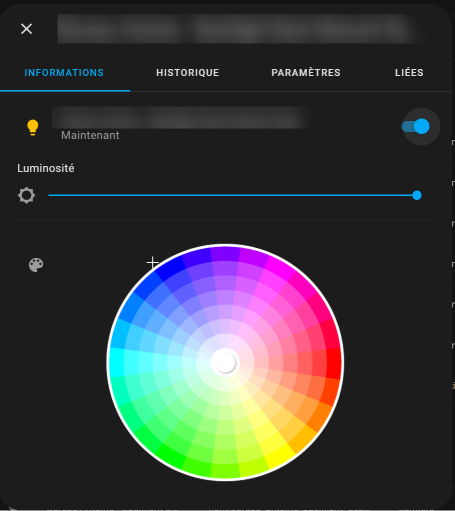
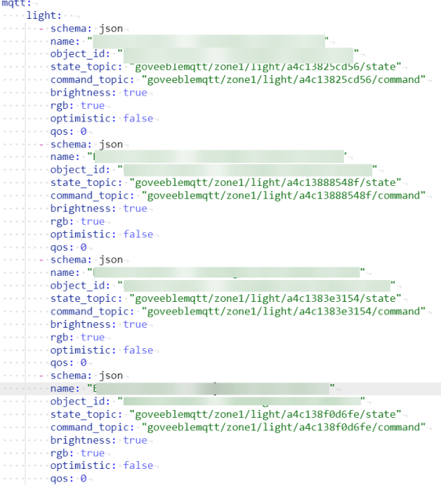

# GoveeBleMqttServer
GoveeBleMqttServer is a Govee Bluetooth Low Energy Mqtt light controller.
* Free software: MIT license



# Requirements
A Bluetooth Low Energy compatible adapter

# Installation
Requires Python 3.
Tested under Python 3.7 on Linux, Windows

```bash
pip install paho-mqtt
pip install bleak
```

# Features
* Control Govee lights over Bluetooth Low Energy
* Mqtt support for connecting to Home Assistant
* Multi-zone support (To cover wider Bluetooth area)
* Auto configuration from Home Assistant Mqtt objects
* Keep alive BLE for fast response time

# Beware: dongles with the same MAC address!
Multiple dongles of the same brand will share the same MAC address and violates the specifications.
Having multiple dongles with the same MAC address will cause interference and will make the connections not working.

If you are lucky, you can re-program the dongles to change its MAC address (RUN AT YOUR OWN RISKS)
- Windows: [Bluetooth MAC Address Changer](https://macaddresschanger.com/)
- Linux: [bdaddr](https://github.com/thxomas/bdaddr)

# Tested hardware
- H6008 Fully functional
- H6107 Fully functional
- H6138 Fully functional
- H6139 Fully functional
- H613A Fully functional
- H613B Fully functional
- H6159 Fully functional
- H6159r2 (Rev 2) Fully functional
- H6712 Fully functional (With segment control, but not Cold/Warm)
- H618F Fully functional (With segment control)


# Configuration

Configuration is located at top of file main.py
```python
SERVER_ZONE_ID: int = 1;
MQTT_SERVER: str = "192.168.10.170";
MQTT_PORT: int = 1883;
MQTT_USER: str = None;
MQTT_PASS: str = None;
```

# Home Assistant
In configuration.yaml, for each of your light add the following:
```yaml
mqtt:
    light:
      - schema: json
        name: "NAME OF THE LIGHT"
        object_id: "NAME OF THE LIGHT"
        state_topic: "goveeblemqtt/zone1/light/MacAddressLowerNoDots_ModelNumber/state"
        command_topic: "goveeblemqtt/zone1/light/MacAddressLowerNoDots_ModelNumber/command"
        brightness: true
        rgb: true
        optimistic: false
        qos: 0
        unique_id: "RANDOM_UNIQUE_ID_HERE"
        device:
            identifiers: "RANDOM_UNIQUE_ID_HERE"
            name: "NAME OF THE LIGHT"
```
Create a random unique id and replace RANDOM_UNIQUE_ID_HERE twice (this is used internally by Home Assistant).

Replace NAME OF THE LIGHT three times by the name of your light

Replace MacAddressLowerNoDots twice by the Bluetooth mac address of your light, for instance a4c13825cd56
Replace ModelNumber twice by the model number of your light, for instance H6008

Multiple lights example:



# Credits
- [chvolkmann](https://github.com/chvolkmann/govee_btled/tree/master/govee_btled)
